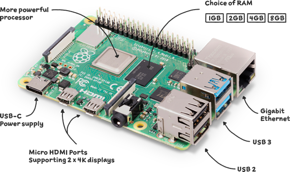

# Raspberry Pi Tutorials

<figure><figcaption></figcaption></figure>

* [GPIOZERO 及傳器的應用](broken-reference)
* [PiCamera 的應用](broken-reference)
* [DIY 顯微鏡](broken-reference)
* [縮時攝影](broken-reference)
