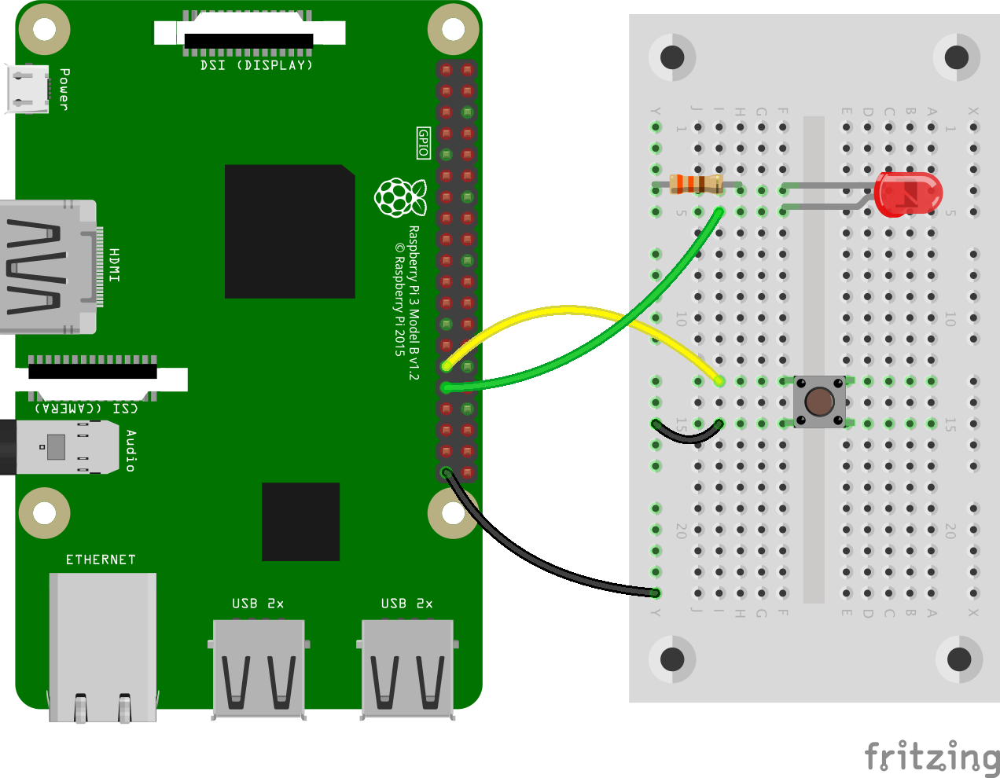

# Ex3 - Button controlled LED

## 任務 1

<figure><figcaption></figcaption></figure>

另開新檔。以下程式碼，在按下 `Button` 時打開 `LED`


```python
from gpiozero import LED, Button
from signal import pause

button = Button(5)
led = LED(6)

button.when_pressed = led.toggle

pause()
```


## 任務 2

另開新檔， `button_led_2.py`。參考 Ex2 - Button 中的[任務4](ex2-button.md#ren-wu-4)，修改以上程式碼，讓你可以在當按下按扭時開啟／閃動 `LED`，放手時會關閉 `LED`。以下是你可能需要用的資料連結。

* [`led.on`](https://gpiozero.readthedocs.io/en/stable/api\_output.html#gpiozero.LED.on)
* [`led.off`](https://gpiozero.readthedocs.io/en/stable/api\_output.html#gpiozero.LED.off)
* [`led.blink`](https://gpiozero.readthedocs.io/en/stable/api\_output.html#gpiozero.LED.blink)
