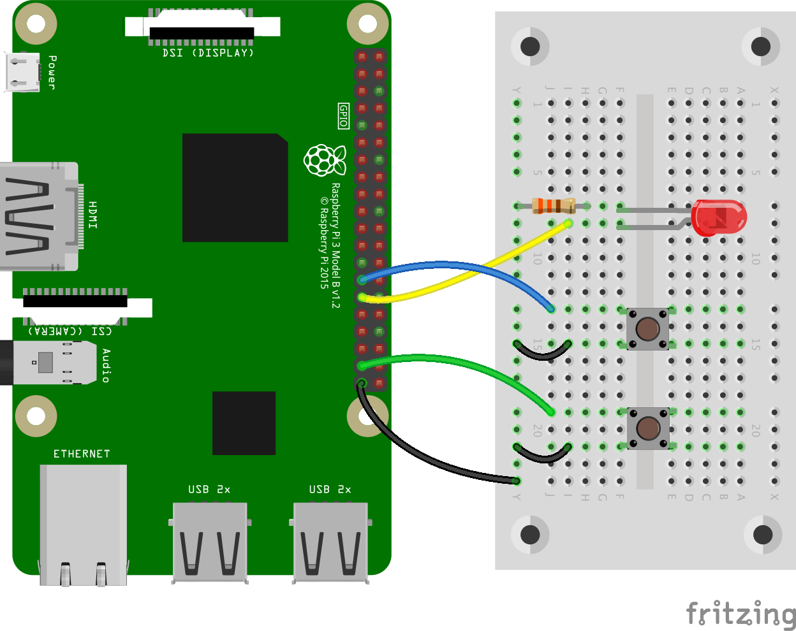

# Ex4 - Reaction Game

## 任務 1

<figure><figcaption></figcaption></figure>

另開新檔 `reaction_game.py`。當看到燈亮起時，第一個按下 `Button` 的人獲勝！

* 試試了解以下每一行程式碼的意義


```python
from gpiozero import Button, LED
from time import sleep
import random

led = LED(6)
player_1 = Button(5)
player_2 = Button(26)

time = random.uniform(5, 10)
sleep(time)
led.on()

while True:
    if player_1.is_pressed:
        print("Player 1 wins!")
        break
    if player_2.is_pressed:
        print("Player 2 wins!")
        break

led.off()
```


\
