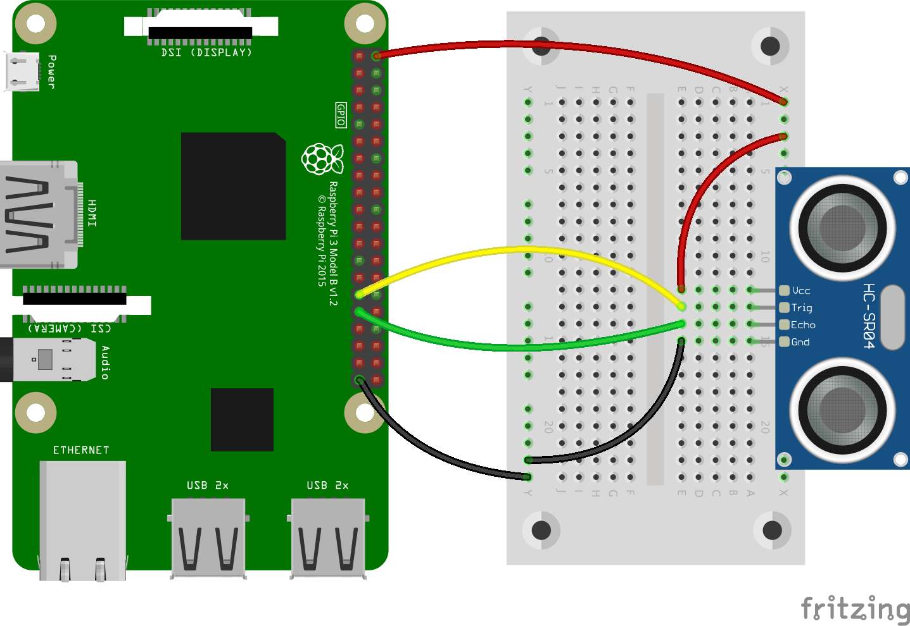

# Ex5 - Distance Sensor

## 任務 1

另開新檔 `distance.py` 利用以程式碼使 `Distance Sensor` 檢測到最近物體的距離

**同學**<mark style="color:red;">**必須注意**</mark>**四支針腳的名稱，分別是 `VCC`, `Trig`, `Echo`, `GND`，不可以連接錯誤******

<figure><figcaption></figcaption></figure>


```python
from gpiozero import DistanceSensor
from time import sleep

trig = 5
echo = 6

sensor = DistanceSensor(echo, trig)

while True:
    print(sensor.distance * 100, 'cm')
    sleep(1)
```


## 任務 2

另開新檔 `distance_2.py`，以下程式碼為當有東西靠近傳感器時，LED 會亮。按以下程式碼連接所需裝置。


```python
from gpiozero import DistanceSensor, LED
from signal import pause

trig = 5
echo = 6
led = LED(26)

sensor = DistanceSensor(
    echo, 
    trig,
    max_distance=1,
    threshold_distance=0.2
)

sensor.when_in_range = led.on
sensor.when_out_of_range = led.off

pause()
```


* `threshold` - 啟動值
