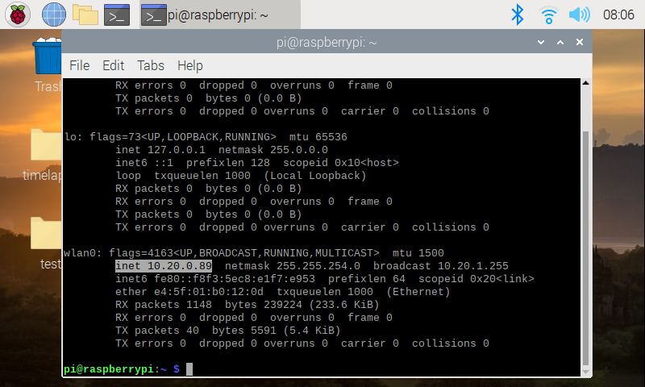

# Ex6 Webcam

## 任務 1

另開新檔 `webcam.py`，以下程式碼**毋須**配撘任何裝置，只須裝好 `camera` 即可。


```python
import io
import picamera
import logging
import socketserver
from threading import Condition
from http import server

PAGE="""\
<html>
<head>
<title>picamera MJPEG streaming demo</title>
</head>
<body>
<h1>PiCamera MJPEG Streaming Demo</h1>

</body>
</html>
"""

class StreamingOutput(object):
    def __init__(self):
        self.frame = None
        self.buffer = io.BytesIO()
        self.condition = Condition()

    def write(self, buf):
        if buf.startswith(b'\xff\xd8'):
            # New frame, copy the existing buffer's content and notify all
            # clients it's available
            self.buffer.truncate()
            with self.condition:
                self.frame = self.buffer.getvalue()
                self.condition.notify_all()
            self.buffer.seek(0)
        return self.buffer.write(buf)

class StreamingHandler(server.BaseHTTPRequestHandler):
    def do_GET(self):
        if self.path == '/':
            self.send_response(301)
            self.send_header('Location', '/index.html')
            self.end_headers()
        elif self.path == '/index.html':
            content = PAGE.encode('utf-8')
            self.send_response(200)
            self.send_header('Content-Type', 'text/html')
            self.send_header('Content-Length', len(content))
            self.end_headers()
            self.wfile.write(content)
        elif self.path == '/stream.mjpg':
            self.send_response(200)
            self.send_header('Age', 0)
            self.send_header('Cache-Control', 'no-cache, private')
            self.send_header('Pragma', 'no-cache')
            self.send_header('Content-Type', 'multipart/x-mixed-replace; boundary=FRAME')
            self.end_headers()
            try:
                while True:
                    with output.condition:
                        output.condition.wait()
                        frame = output.frame
                    self.wfile.write(b'--FRAME\r\n')
                    self.send_header('Content-Type', 'image/jpeg')
                    self.send_header('Content-Length', len(frame))
                    self.end_headers()
                    self.wfile.write(frame)
                    self.wfile.write(b'\r\n')
            except Exception as e:
                logging.warning(
                    'Removed streaming client %s: %s',
                    self.client_address, str(e))
        else:
            self.send_error(404)
            self.end_headers()

class StreamingServer(socketserver.ThreadingMixIn, server.HTTPServer):
    allow_reuse_address = True
    daemon_threads = True

with picamera.PiCamera(resolution='640x480', framerate=24) as camera:
    output = StreamingOutput()
    camera.start_recording(output, format='mjpeg')
    try:
        address = ('', 80)
        server = StreamingServer(address, StreamingHandler)
        server.serve_forever()
    finally:
        camera.stop_recording()
```


打開 `Terminal`&#x20;

<figure><figcaption></figcaption></figure>

輸入 `ifconfig` ，以找出 `Raspberry Pi` 連接網絡時的 `IP` 位置。學校是用無線網絡，因此 `IP` 位置可以在 `wlan0` 中找到，`inet` 所示就是 `IP` 位置

<figure><figcaption></figcaption></figure>

把你的手機連接與 `Raspberry Pi` 相同的無線網絡，在你的手機中，打開網頁。在網址一欄中，輸入你剛取得的 `IP` 位置。現在你的手機能看到 `Raspberry Pi` 鏡頭的影像嗎？
