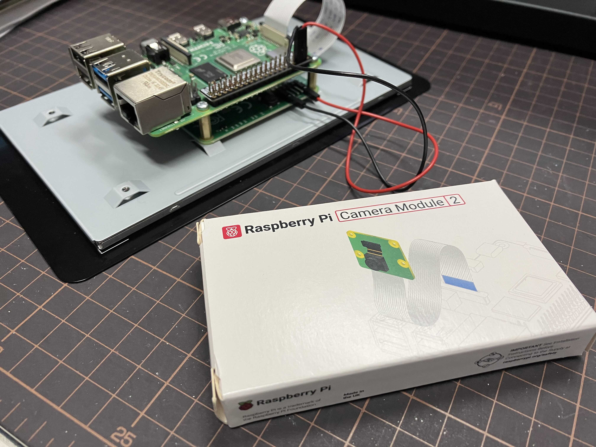
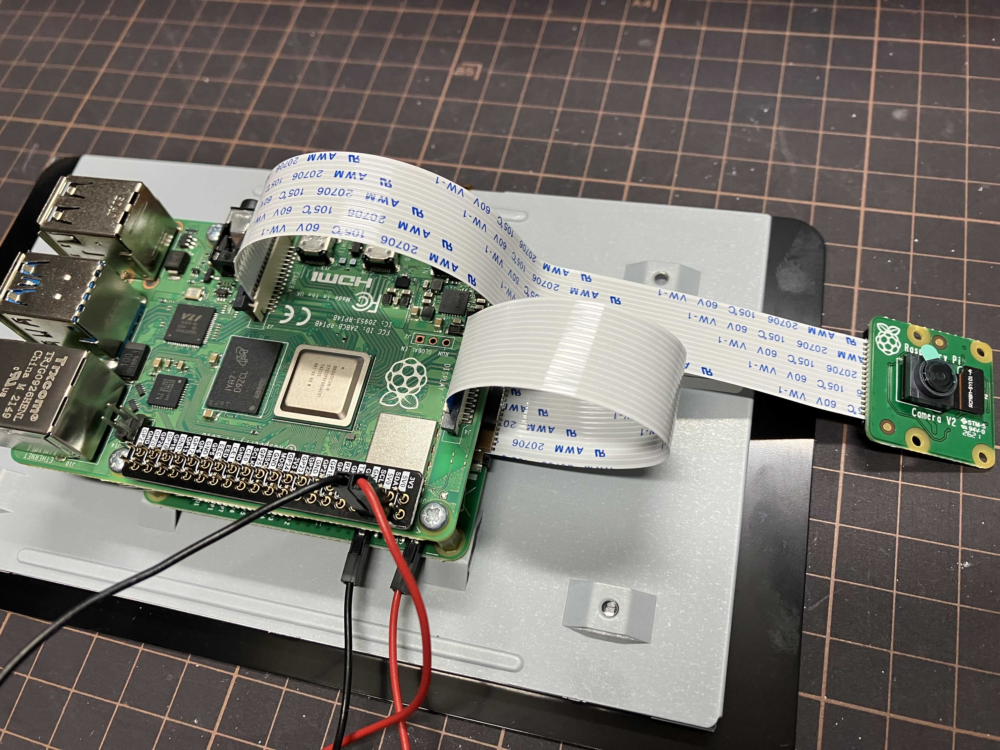

# 接駁鏡頭

取出鏡頭套件

<figure><figcaption>
取出鏡頭套件
</figcaption></figure>

接上帶狀電線 (Ribbon Connector)

<figure><figcaption>
接上帶狀電線 (Ribbon Connector)
</figcaption></figure>

啟動 `Raspberry Pi` 後，到 `Raspberry Pi Configuration` 進行設定。

<figure><figcaption>
啟動 <code>Raspberry Pi</code> 後，到 <code>Raspberry Pi Configuration</code> 進行設定。
</figcaption></figure>

將 `Camera` 設定為 `enable`

<figure><figcaption>
將 <code>Camera</code> 設定為 <code>enable</code>
</figcaption></figure>
