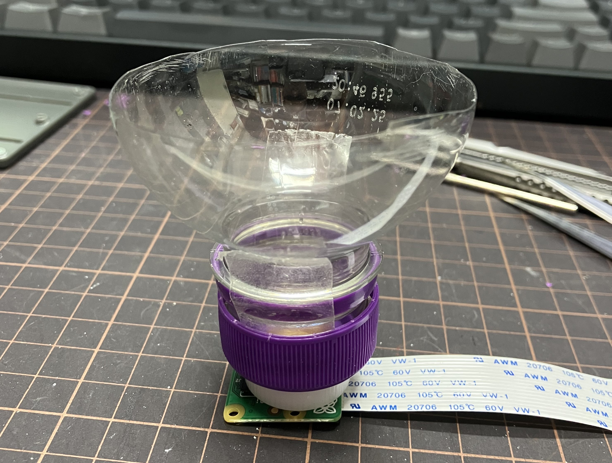

# 編寫程式

參考 [ex6-webcam.md](../application-of-picamera/ex6-webcam.md "mention") 及 [ex3-button-controlled-led.md](../gpio/ex3-button-controlled-led.md "mention")，在用利用手機擷取洋䓤表皮細胞的成像時，可以利用按扭開關 LED ，以加強在拍攝洋䓤表皮細胞的光源，使成像更加清𥇦。

<figure><figcaption></figcaption></figure>
