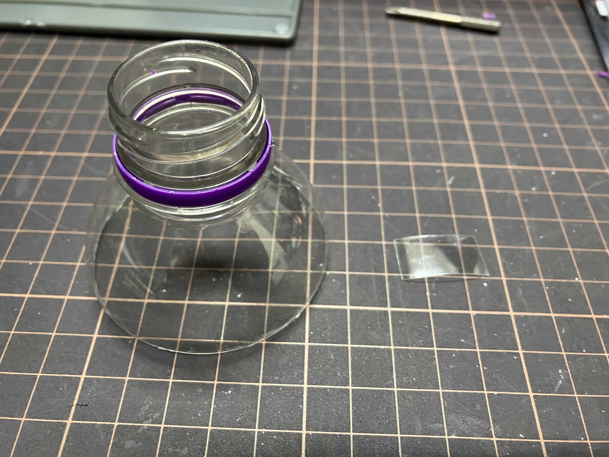
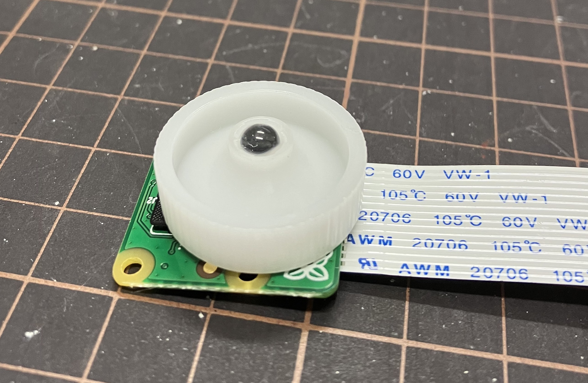

# 顯微鏡製作步驟

固定樽蓋後，用手鑽開孔。

<figure><figcaption></figcaption></figure>

&#x20;把較剪插入蓋孔後，轉動較剪擴大蓋孔。

<figure><figcaption></figcaption></figure>

白色膠蓋應可插入水樽的蓋孔中

<figure><figcaption></figcaption></figure>

𠝹開膠樽，取出膠樽的頂部分及一塊膠片

<figure><figcaption></figcaption></figure>

在膠片上滴上一至兩滴甘油

<figure><figcaption></figcaption></figure>

利用鋏子，取出洋葱的表皮細胞。

<figure><figcaption></figcaption></figure>

把洋葱表皮細胞放上甘油上

<figure><figcaption></figcaption></figure>

然後滴上碘液，待 1 至 2 秒後，用紙巾吸去多餘的碘液及甘油。

<figure><figcaption></figcaption></figure>

用膠把洋葱表皮細胞及膠片固定好在水樽上，然後把擰上水樽蓋。洋葱裝置製作完成。

<figure><figcaption></figcaption></figure>

把透明膠珠放在白色膠蓋中

<figure><figcaption></figcaption></figure>

再把洋葱裝置放在白色膠蓋上。

<figure><figcaption></figcaption></figure>
