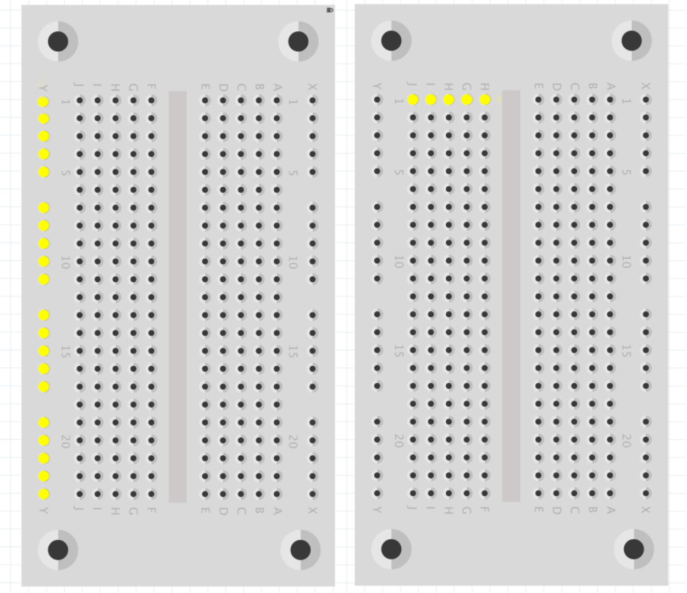

# 基本認識

圖中任何標有 `GPIO` 的針都可以用針號。 例如，如果將 LED 連接到  GPIO17 ，您可以將針號指定為 17 (而不是 11)。Gound 表示負極。

<figure><figcaption>
GPIO
</figcaption></figure>

麪包版的最左及最右的長直行是通電的，而每一短橫行也是通電。

<figure><figcaption></figcaption></figure>
