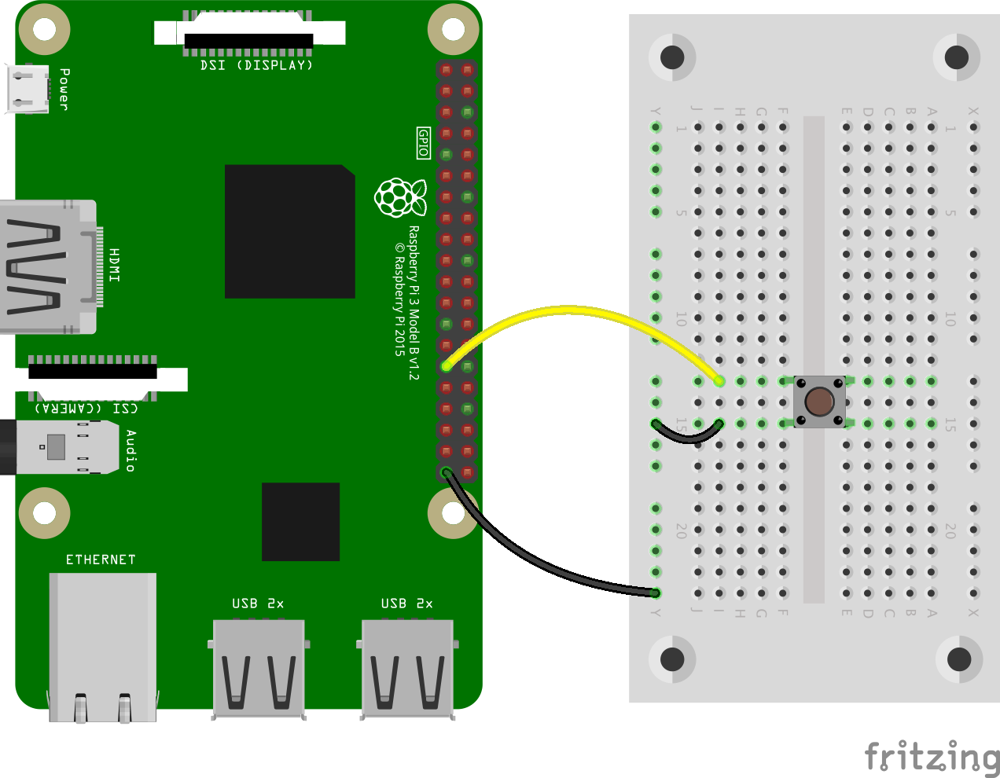

# Ex2 - Button

## 任務 1

按下圖連接按扭

<figure><figcaption></figcaption></figure>

另開新檔 `button.py`。利用以下程式碼，檢查 `Button` 是否被按下


```python
from gpiozero import Button

button = Button(5)

while True:
    if button.is_pressed:
        print("Button is pressed")
    else:
        print("Button is not pressed")
```


## 任務 2

另開新檔 `button_wait.py`，以下程式碼，會等待按下 (Wait for press) 按扭後才繼續執行程式


```python
from gpiozero import Button

button = Button(5)

button.wait_for_press()
print("Button was pressed")
```


## 任務 3

另開新檔  ，了解以下程式碼，當每次按下按鈕時，會執行 `say_hello`。


```python
from gpiozero import Button
from signal import pause

def say_hello():
    print("Hello!")

button = Button(5)

button.when_pressed = say_hello

pause()
```


## 任務 4

另開新檔 `button_say_goodbye.py`。除了在按下按鈕時執行程式，也可以在放開按鈕時執行程式，如 `say_goodbye`


```python
from gpiozero import Button
from signal import pause

def say_hello():
    print("Hello!")

def say_goodbye():
    print("Goodbye!")

button = Button(5)

button.when_pressed = say_hello
button.when_released = say_goodbye

pause()
```

