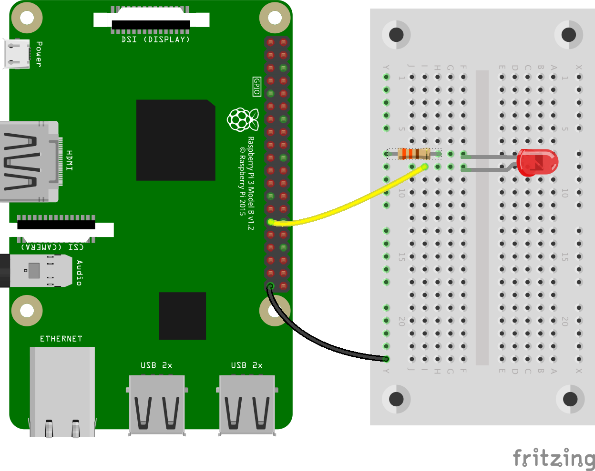

# Ex1 - LED

## 任務 1&#x20;

按下圖連接裝置，連接 `GPIO` 5 及 `GND`

<figure><figcaption></figcaption></figure>

另開新檔 `led.py`。以下程式碼會讓 `LED` 反復開關。


```python
from gpiozero import LED
from signal import pause

led = LED(5)
led.blink()

pause()
```

