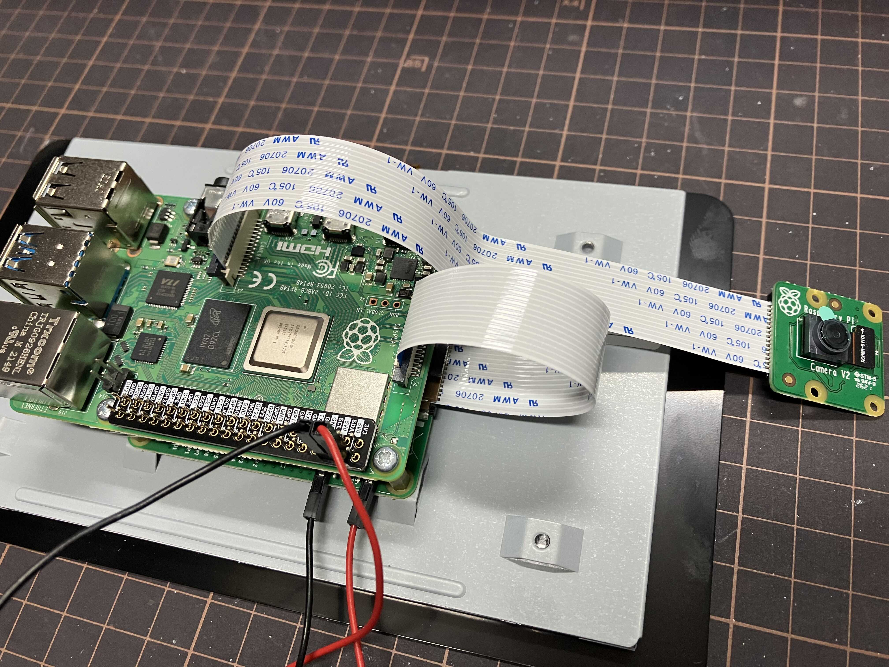
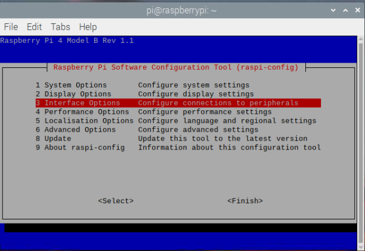
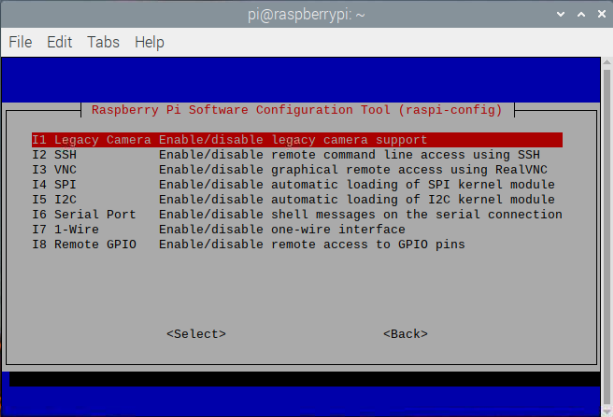
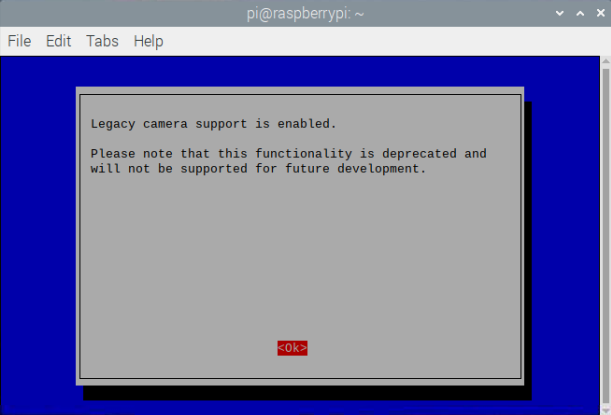
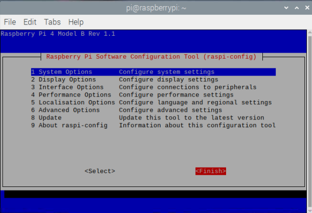
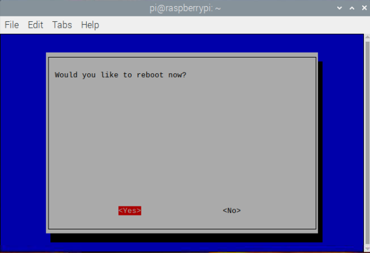

# 接駁鏡頭

取出鏡頭套件

<figure><figcaption><p>取出鏡頭套件</p></figcaption></figure>

接上帶狀電線 (Ribbon Connector)

<figure><figcaption><p>接上帶狀電線 (Ribbon Connector)</p></figcaption></figure>

啟動 `Raspberry Pi` 後，打開 `Terminal` ，然後輸入以下指令

```bash
sudo raspi-config
```

<figure><figcaption></figcaption></figure>

撰擇 `Interfacing Options`

<figure><figcaption></figcaption></figure>

㨂撰 `Legacy Camera Enable/disable legacy camera support`，然後按 `Enter`

再撰 `Yes` 確認

<figure><figcaption></figcaption></figure>

㨂選 `ok` 離開&#x20;

<figure><figcaption></figcaption></figure>

㨂選 `Finish` 完成

<figure><figcaption></figcaption></figure>

揀選 `Yes` 重啟 (Reboot) `Raspberry Pi`&#x20;

<figure><figcaption></figcaption></figure>
