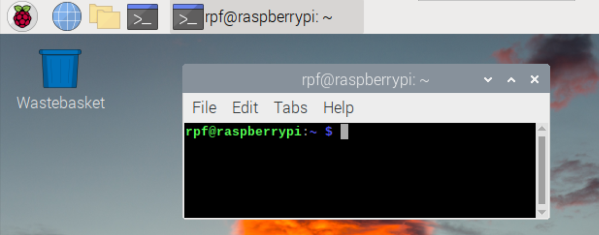

# Ex 7 Intruder

&#x20;打開 `Terminal`

<figure><figcaption></figcaption></figure>

輸入以下指令，以安裝所須套件，安裝時間頗長，請耐心等候。

```sh
sudo apt-get install libatlas-base-dev
pip3 install opencv-python
pip3 install face_recognition
```

開新檔案 `registration.py`。 利用以下程式登記使用者。


```python
from picamera import PiCamera
from time import sleep
from os import makedirs, path

registration_directory = '/home/pi/registration'

if not path.exists(registration_directory):
    makedirs(registration_directory)
    
camera = PiCamera()

username = input('登記的使用者 (按空白跳過)： ')

if username == '':
    exit()

camera.start_preview()

while username != '':
    image_path = f'{registration_directory}/{username}.jpg'
    sleep(5)
    camera.capture(image_path)
    camera.stop_preview()

    username = input('下一個登記的使用者：(按空白跳過) ')

print('登記完成')
camera.close()

```


開啟新檔 `intruder.py` ，將 `LED` 連接到 `GPIO5` 然後執行程式。


```python
from gpiozero import LED
from os import listdir, path

import face_recognition
import cv2
import numpy as np

led = LED(5)

# 用作儲存已登記的 face_encoding 及 name
known_face_encodings = []
known_face_names = []

registration_directory = '/home/pi/registration'

# 如果未有 registration_directory, 將關閉程式
if not path.exists(registration_directory):
    exit()

# 從 registration_directory 中，載入並識別圖片
for image_file in listdir(registration_directory)
    filename, ext = path.splitext(image_file)
    user_image = face_recognition.load_image_file(image_file)
    face_encoding = face_recognition.face_encodings(user_image)[0]

    known_face_encodings.append(face_encoding)
    known_face_names.append(filename)

video_capture = cv2.VideoCapture(0)

face_locations = []
face_encodings = []
face_names = []
process_this_frame = True
UNKNOWN = "Unknown"

while True:
    ret, frame = video_capture.read()

    if process_this_frame:
        small_frame = cv2.resize(frame, (0, 0), fx=0.25, fy=0.25)

        rgb_small_frame = small_frame[:, :, ::-1]

        face_locations = face_recognition.face_locations(rgb_small_frame)
        face_encodings = face_recognition.face_encodings(
            rgb_small_frame, face_locations
        )

        face_names = []
        for face_encoding in face_encodings:
            matches = face_recognition.compare_faces(
                known_face_encodings, face_encoding
            )

            face_distances = face_recognition.face_distance(
                known_face_encodings, face_encoding
            )

            best_match_index = np.argmin(face_distances)

            if matches[best_match_index]:
                name = known_face_names[best_match_index]
            else:
                name = UNKNOWN

            face_names.append(name)

    process_this_frame = not process_this_frame
    led.off()

    # 顯示結果
    for (top, right, bottom, left), name in zip(face_locations, face_names):
        top *= 4
        right *= 4
        bottom *= 4
        left *= 4
        
        # 畫上方框 
        cv2.rectangle(frame, (left, top), (right, bottom), (0, 0, 255), 2)
        cv2.rectangle(
            frame,
            (left, bottom - 35),
            (right, bottom),
            (0, 0, 255),
            cv2.FILLED
        )
        
        # 寫上名稱 
        font = cv2.FONT_HERSHEY_DUPLEX
        cv2.putText(
            frame,
            name,
            (left + 6, bottom - 6),
            font,
            1.0,
            (255, 255, 255),
            1
        )
        
        # 如果發現有未登錄的人，會亮起 LED
        try:
            face_names.find(UNKNOWN)
            led.on()
        except:
            led.off()

    cv2.imshow('Video', frame)

    # 按 'q' 關閉程式
    if cv2.waitKey(1) & 0xFF == ord('q'):
        break

video_capture.release()
cv2.destroyAllWindows()
```

