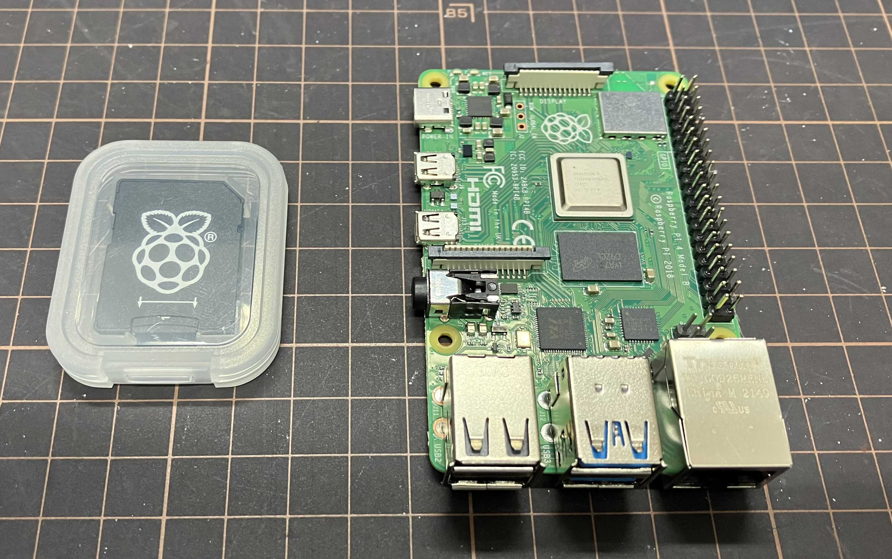
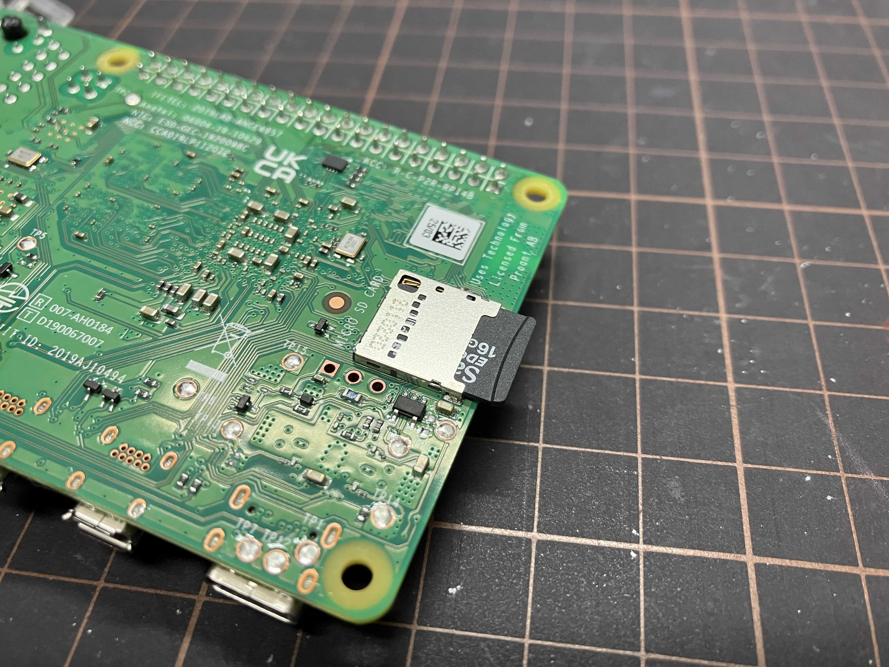
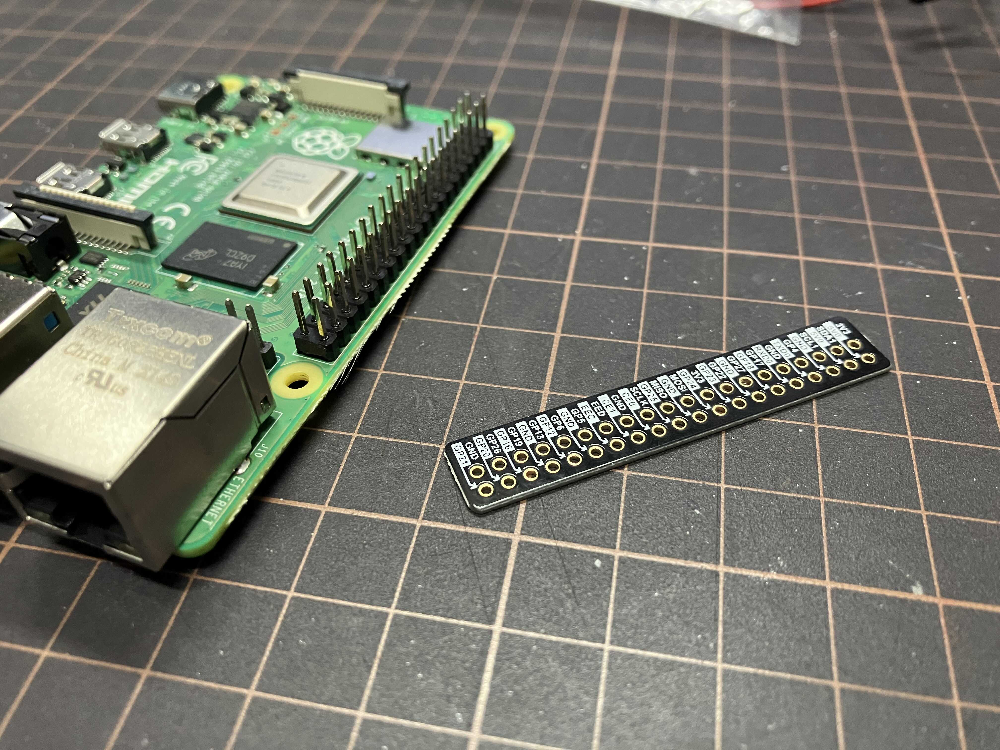
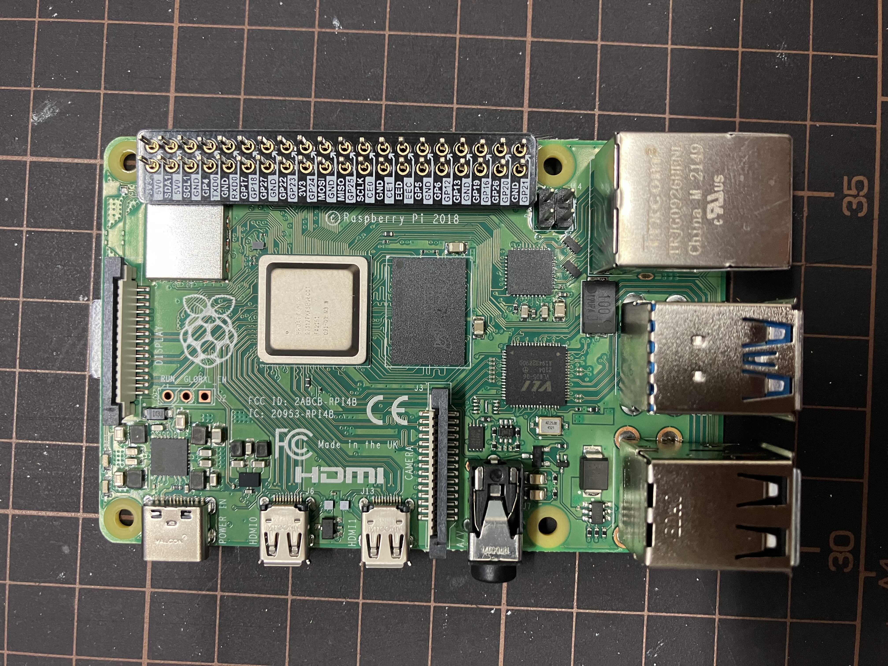
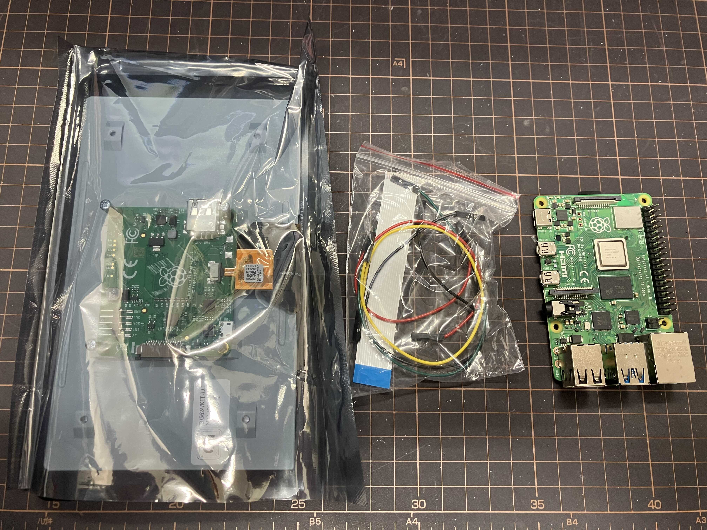
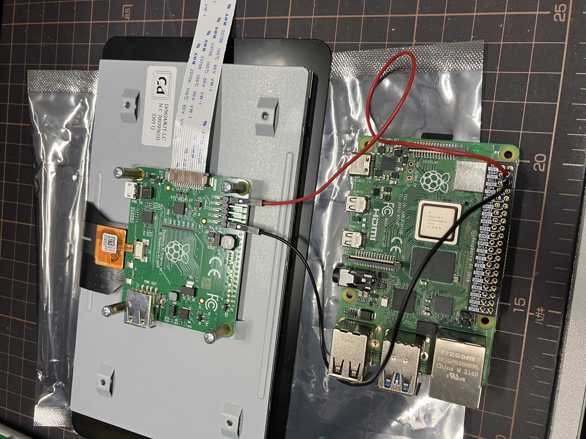
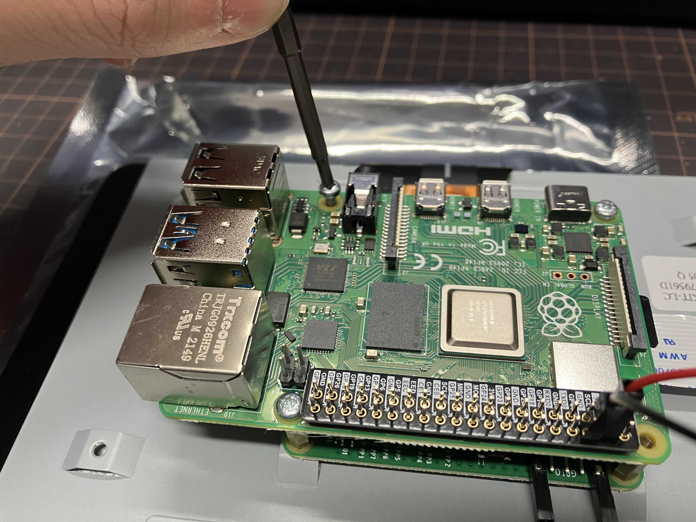
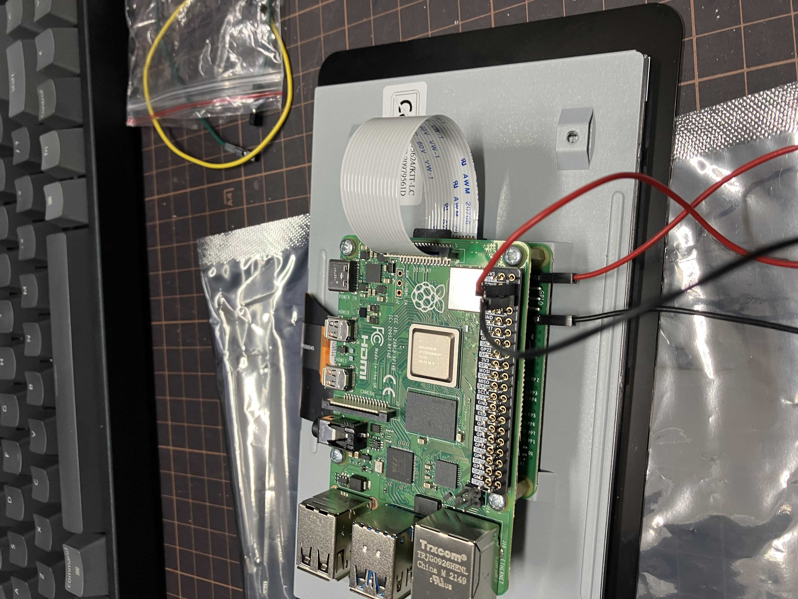
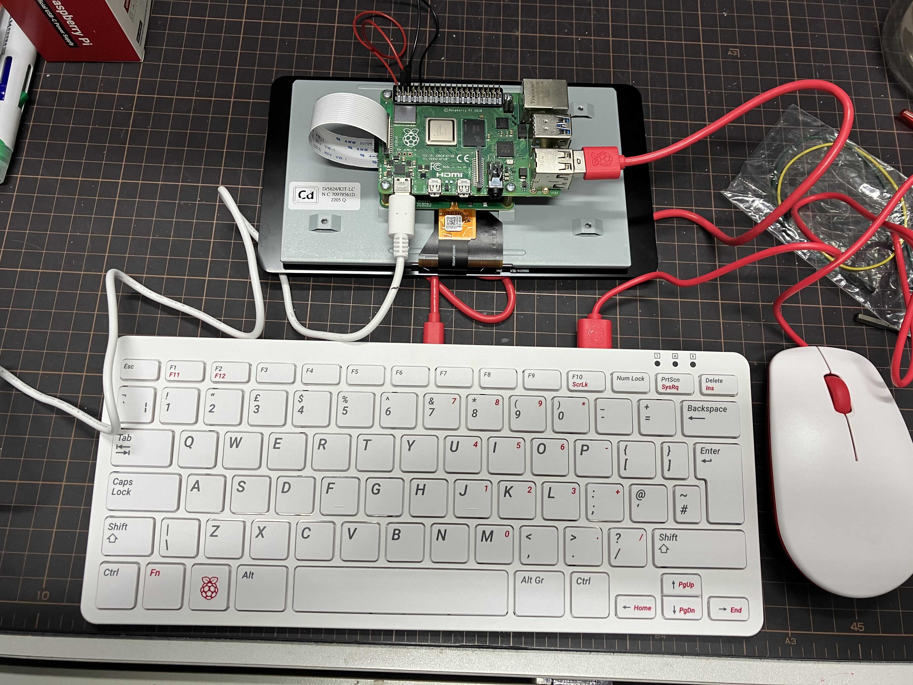

# 安裝

取出 SD Card 及 Raspberry Pi

<figure><figcaption>
取出 SD Card 及 Raspberry Pi
</figcaption></figure>

將 SD Card （細咭）插入 Raspberry Pi 中

<figure><figcaption>
將 SD Card 插入 Raspberry Pi 中
</figcaption></figure>

取出 GPIO 參考版

<figure><figcaption>
取出 GPIO 參考版
</figcaption></figure>

將 GPIO 參考版套上 GPIO 針上

<figure><figcaption>
將 GPIO 參考版套上 GPIO 針上
</figcaption></figure>

取出屏幕套件

<figure><figcaption>
取出屏幕套件
</figcaption></figure>

接上帶狀電線 (Ribbon Connector)。注意，需先將插口的兩旁的黑色扣拉出，然後插入帶狀電線，完成後將黑色扣推入，以鎖緊帶狀電線。

<figure><figcaption>
接上帶狀電線 (Ribbon Connector)
</figcaption></figure>

用紅色連接 `5V` 至 GPIO 的 `5V0`， 黑色連接 `GND`

<figure><figcaption>
用紅色連接 5V 至 GPIO 的 5V0， 黑色連接 GND
</figcaption></figure>

上緊螺絲

<figure><figcaption>
上緊螺絲
</figcaption></figure>

再將帶狀電線 (Ribbon Connector) 接上 Raspberry Pi

<figure><figcaption>
再將帶狀電線 (Ribbon Connector) 接上 Raspberry Pi
</figcaption></figure>

接上鍵盤、滑鼠及電源

<figure><figcaption>
接上鍵盤、滑鼠及電源
</figcaption></figure>

