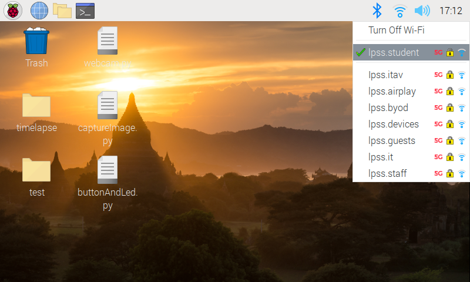
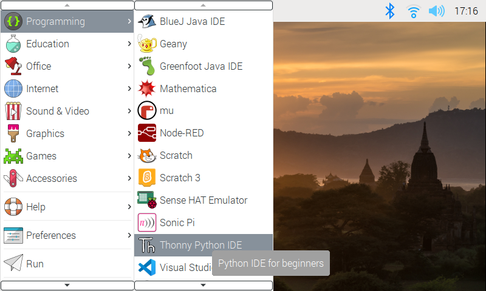
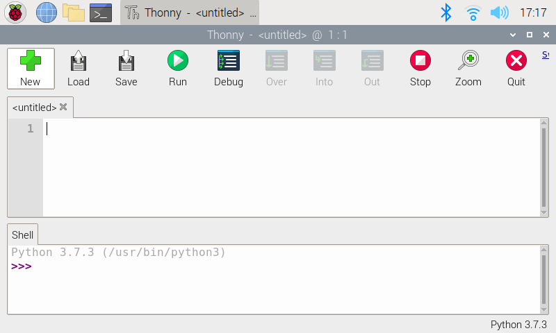
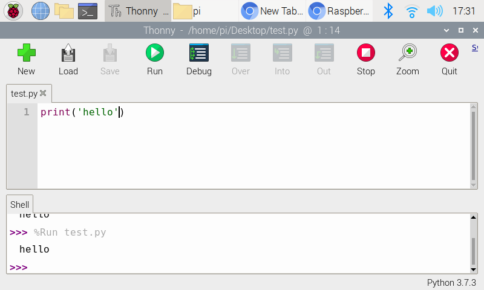

# 設定及使用 Raspberry Pi

先連接 WiFi

<figure><figcaption><p>先連接 WiFi</p></figcaption></figure>

利用 Thonny Python 編寫程式

<figure><figcaption><p>利用 Thonny Python 編寫程式</p></figcaption></figure>


每一次編程，也要新增一個新的檔案，檔案要以 .py 結尾

<figure><figcaption><p>每一次編程，也要新增一個新的檔案，檔案要以 .py 結尾</p></figcaption></figure>

現在先試一次，按 `New` 後，再按 `Save` 以建立 `test.py` 檔案

<figure><figcaption><p>現在先試一次，建立 test.py 檔案</p></figcaption></figure>

然後複製及貼上以下程式，完成後按 `Run` 執行，在下方 Shell 應該會出現結果 `hello`


```python
print('hello')
```


<figure><figcaption><p>然後輸入以上程式，完成後按 <code>Run</code> 執行，在下方 Shell 應該會出現結果 <code>hello</code></p></figcaption></figure>
